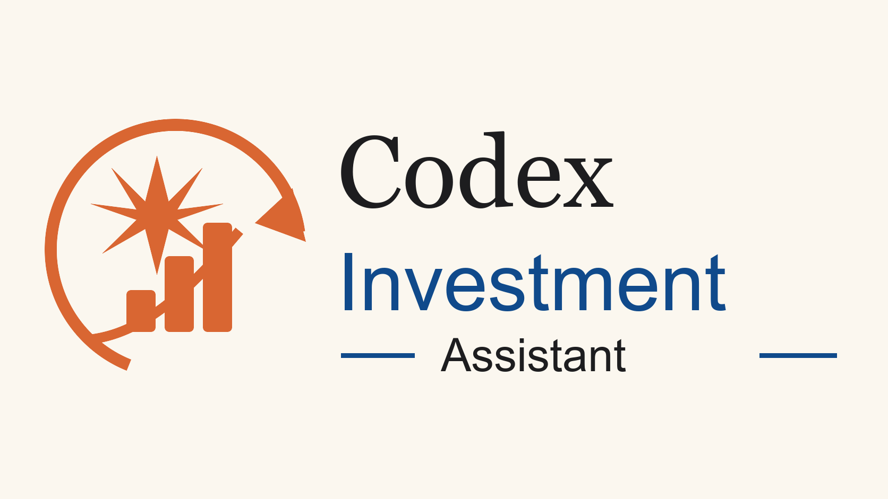

<div align="center">



# codex-investment-plugin

**A Codex plugin for designing, tracking, and running personal investment strategies with Alpaca.**

[](https://opensource.org/licenses/MIT)
[](https://github.com/FarzamHejaziK/codex-investment-plugin/stargazers)
[](https://github.com/FarzamHejaziK/codex-investment-plugin/commits/main)
[](https://github.com/FarzamHejaziK/codex-investment-plugin/issues)
[](https://openai.com/codex)
[](https://alpaca.markets/)

[About](#about) - [Quick start](#quick-start) - [Installation](docs/installation.md) - [Documentation](#documentation) - [Examples](#the-three-example-strategies) - [FAQ](docs/faq.md) - [Safety](docs/safety-and-limits.md)

</div>

---

## About

`codex-investment-plugin` is a Codex plugin that automates your investing routine every morning. Rules over emotion. No fear, no FOMO. It ships with three default strategies — dip-buying, AI value-chain DCA, and mean-reversion active trading — and helps you build your own if you'd like.

The plugin keeps strategies as plain markdown files, pulls Alpaca portfolio data through MCP, writes daily research and trade-proposal memos, and supports an optional confirmation-gated trading mode.

The plugin is designed for user-authored rules, transparent journals, and explicit human control. It is not financial advice, not a robo-advisor, and not an autonomous trading system.

---

You define your rules in markdown strategy files. Each market day you run `/investment:daily`. It reads your Alpaca portfolio, checks your rules, writes a dated journal memo, and tells you exactly what the rules propose today.

By default, it is **proposal-only**: Codex writes the memo and you place orders yourself in Alpaca. If you explicitly choose **trading-with-confirmation** during setup, `/investment:daily` may submit only the exact order batch shown in chat after you type the exact confirmation phrase.

> **This is not financial advice.** This is a tool for organizing and tracking your own investment decisions. Past performance does not guarantee future results. If you use live Alpaca credentials or trading-with-confirmation mode, real money can move. Read [Safety and limits](docs/safety-and-limits.md) and [Trading mode](docs/trading-mode.md) first.

---

## What It Does

1. Creates or reuses a persistent workspace for your personal files.
2. Seeds example strategy files into `<workspace>/strategies/`.
3. Runs four Codex slash commands:
   - `/investment:setup`
   - `/investment:daily`
   - `/investment:new-strategy`
   - `/investment:help`
4. Pulls Alpaca account state and market data through the Alpaca MCP.
5. Writes daily memos to `<workspace>/journal/`.
6. Optionally submits confirmed Alpaca orders when trading-with-confirmation mode is enabled.

## What It Does Not Do

- It does not provide financial advice.
- It does not invent securities outside your strategy files.
- It does not trade by default.
- It does not place orders from setup, help, or strategy-builder commands.
- It does not silently edit operational strategy rules.

## Quick Start

### What You Need

- An [Alpaca account](https://alpaca.markets/) for paper or live trading.
- Codex with plugin support.
- `uv` / `uvx` for the Alpaca MCP server.
- About 30 minutes for first-time setup.

### 5 Steps

1. Register this repo as a Codex plugin marketplace:

   ```bash
   codex plugin marketplace add FarzamHejaziK/codex-investment-plugin --ref main
   ```

2. Open Codex, run `/plugins`, install **Codex Investment Assistant** from the **Codex Investment Plugin** marketplace, then start a new thread.

3. Run `/investment:setup`. The wizard:
   - Creates or locates your persistent workspace.
   - Asks paper or live.
   - Asks proposal-only or trading-with-confirmation.
   - Walks you through Alpaca API keys and Codex MCP setup.
   - Copies example strategies into your workspace and asks which to configure.

4. Activate at least one strategy when ready:
   - Open `<workspace>/strategies/<name>.md`.
   - Set `status: active`.
   - Confirm `capital_monthly_usd` matches your intended budget.

5. Run `/investment:daily`.

The workspace path is stored in `~/.codex-investment-plugin/config.json`. Override it anytime by setting `CODEX_INVESTMENT_WORKSPACE=/path/to/workspace` before running a command.

For local clone/development installation, see [Installation](docs/installation.md). `git clone` plus `cd` alone does not install a Codex plugin; Codex discovers installable plugins through marketplace metadata.

## The Three Example Strategies

All ship `status: paused` for safety. Setup can copy and configure them, but the user decides whether to activate.

| File | Style | Risk | Good for |
|---|---|---|---|
| [`dip-buying.example.md`](strategies/dip-buying.example.md) | Continuous-formula dip-buying on broad ETFs (VTI, QQQ). Buy-only. | Low | Long-term accumulation with opportunistic dip overlay |
| [`ai-value-chain.example.md`](strategies/ai-value-chain.example.md) | Monthly equal-weight DCA across 8 AI infrastructure picks-and-shovels names. Buy-only. Daily research. | Medium | Themed long-term exposure beyond mega-cap names |
| [`active-trading.example.md`](strategies/active-trading.example.md) | Daily-checkpoint mean reversion on Mag 10 + ETFs. Buy and sell. Quarterly review. | High | Experimentation with capital you can afford to lose |

## Slash Commands

| Command | When to run | What it does |
|---|---|---|
| `/investment:setup` | Once, after install | Workspace bootstrap, Alpaca keys, MCP wiring, connection verification, strategy configuration |
| `/investment:daily` | Every market morning | Reads strategies, pulls portfolio, proposes orders, writes journal entry, optionally submits confirmed orders |
| `/investment:new-strategy` | Whenever you want a new strategy | Interactive Q&A; writes a paused strategy file in the workspace |
| `/investment:help` | Anytime you're unsure | Conversational guide for orientation, strategy design, and troubleshooting |

Commands live in [`commands/`](commands/). They are markdown prompts, so you can inspect or adapt them. The plugin manifest name is `investment`, so the intended Codex command namespace is `/investment:*`.

## File Layout

```text
codex-investment-plugin/
├── .agents/
│   └── plugins/
│       └── marketplace.json
├── .codex-plugin/
│   └── plugin.json
├── commands/
│   ├── setup.md
│   ├── daily.md
│   ├── new-strategy.md
│   └── help.md
├── scripts/
│   ├── workspace-bootstrap.py
│   ├── alpaca-mcp-wrapper.sh
│   └── validate-plugin.py
├── strategies/
│   └── *.example.md
├── journal/
│   └── .gitkeep
├── docs/
├── AGENTS.md
└── README.md
```

User data lives in the resolved workspace, not in the installed plugin directory, unless you explicitly choose this repo as the workspace.

## Documentation

- [Installation](docs/installation.md)
- [Getting started](docs/getting-started.md)
- [Workspace bootstrap](docs/workspace-bootstrap.md)
- [Alpaca setup](docs/alpaca-setup.md)
- [Trading mode](docs/trading-mode.md)
- [Designing a strategy](docs/designing-a-strategy.md)
- [FAQ](docs/faq.md)
- [Safety and limits](docs/safety-and-limits.md)

## Safety Model

Three layers:

1. **Strategy layer.** Strategy files define allowed instruments, budget, sizing, and buy/sell scope.
2. **Prompt layer.** `/investment:daily` must write the memo before any execution and cannot submit undisplayed orders.
3. **Confirmation layer.** In trading-with-confirmation mode, the user must type `EXECUTE <N> ORDERS` for the exact displayed batch. Anything else stops execution.

Proposal-only remains the default and safest mode.

## Source Attribution

This Codex plugin is adapted from [FarzamHejaziK/claude-investment-assistant](https://github.com/FarzamHejaziK/claude-investment-assistant), currently tracked as the `upstream` remote for parity updates.

## License

MIT. See [LICENSE](LICENSE).
